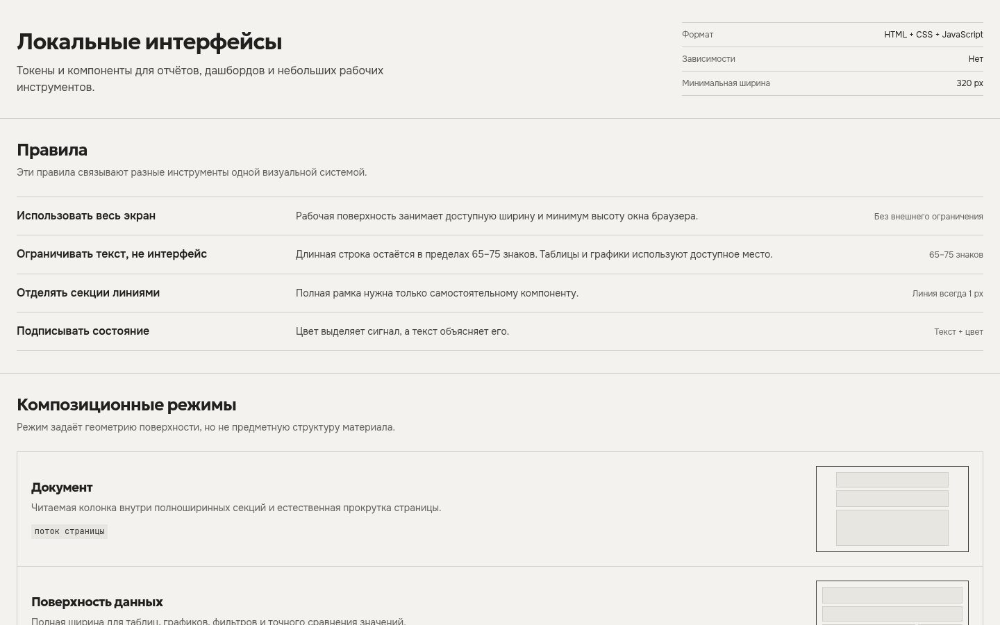
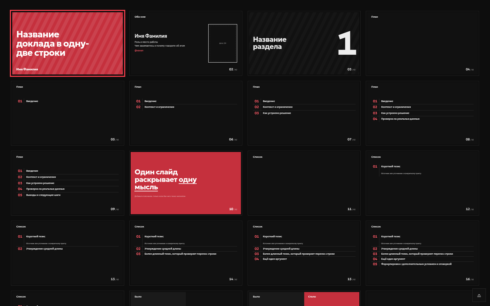

# Craft

Craft — универсальная дизайн-система для автономных интерфейсов, презентаций и новых визуальных форматов. Репозиторий хранит токены, механику, композиционные фрагменты, минимальные стартеры и проверки. Готовых страниц и продуктовых примеров в нём нет.

## Посмотреть систему

Каталог интерфейсов показывает компоненты, их состояния и рецепты сборки. Каталог слайдов проверяет раскладки на тексте, коде, схемах, графиках и медиа.

[](catalog/interfaces/index.html)

[](catalog/slides/index.html)

Оба каталога открываются напрямую через `file://`. Для первого знакомства начните с [рецептов интерфейсов](catalog/interfaces/recipes.html): там компоненты собраны в рабочие конструкции с готовой разметкой.

## Установка как навыка

```bash
npx skills add . --global
```

После перезапуска агента опишите материал и назовите Craft:

```text
Собери в Craft автономную страницу по этим данным: …
Сделай в Craft презентацию доклада на 20 минут: …
```

Агент выберет формат, создаст пустой проект, соберёт композицию из фрагментов и проверит результат. Готовый `index.html` открывается напрямую через `file://`.

## Создание пустого проекта

```bash
# Интерфейс, документ, дашборд или рабочий инструмент
python3 scripts/scaffold.py ./output/материал --surface interface --title "Название"

# Презентация
python3 scripts/scaffold.py ./output/презентация --surface slides --title "Название"
```

Генератор копирует только локальные ресурсы времени выполнения и минимальный `index.html`. Он не выбирает предметную структуру страницы и не добавляет демонстрационные данные. Заголовок экранируется перед вставкой в HTML. Язык документа задаётся параметром `--lang` с тегом вроде `ru` или `en-US`; произвольная строка не принимается.

## Композиция и проверка

Посмотри контракт выбранного фрагмента:

```bash
python3 scripts/compose.py ./output/материал \
  --fragment section --list-placeholders
```

Добавь фрагмент, передавая текст через `--set`, а доверенную разметку — через `--html` или `--html-file`:

```bash
python3 scripts/compose.py ./output/материал \
  --fragment section \
  --set SECTION_ID=summary \
  --set SECTION_TITLE="Заголовок" \
  --set SECTION_SUMMARY="Краткое пояснение" \
  --html 'SECTION_CONTENT=<p>Содержимое</p>'
```

Команда экранирует текст, проверяет типы и коллизии `id`, добавляет локальные зависимости и атомарно вставляет конструкцию в контейнер формата. `--dry-run` выводит результат без изменения проекта.

Проверь готовый материал:

```bash
python3 scripts/check_project.py ./output/материал
```

Полная проверка требует Chromium. Если браузер не находится в `PATH`, передайте путь через `CHROMIUM=/путь/к/chromium`. Без браузера можно выполнить только статическую часть:

```bash
python3 scripts/check_project.py ./output/материал --static-only
```

Автоматически проверяются:

- необработанные подстановки;
- автономность HTML- и CSS-ресурсов, включая `srcset`, `iframe`, `object`, `embed`, `@import` и `url()`;
- выход локальных путей за папку проекта;
- один `h1` и однозначный тип поверхности;
- горизонтальное переполнение на 1440, 390 и 320 px;
- доступные имена элементов управления и порядок заголовков;
- переключение темы, состояние колоды и создание PDF.

`--static-only` выполняет первые три пункта и проверку структуры исходного HTML. Контраст, качество композиции и печати, клавиатурные сценарии, обе темы и уменьшение движения остаются ручной проверкой после автоматического прогона.

## Устройство репозитория

```text
assets/
├── shared/                общие токены и локальные шрифты
├── interfaces/
│   ├── fragments/         универсальные HTML-конструкции
│   ├── starter-index.html минимальная интерфейсная поверхность
│   ├── theme.css          компоненты и композиционные примитивы
│   ├── theme.js           общая механика темы
│   ├── section-nav.js     навигация длинного документа
│   ├── tabs.js            выбор вкладки мышью и клавиатурой
│   ├── dialog.js          вызов модального окна и возврат фокуса
│   └── copy.js            копирование значения в буфер обмена
└── slides/
    ├── fragments/         универсальные раскладки слайдов
    ├── starter/           минимальная колода
    ├── base.css           сцена и режимы просмотра
    ├── theme.css          слайдовая грамматика
    └── deck.js            навигация и печать
references/                правила выбора и применения ассетов
scripts/                   генерация, композиция, проверки и релизы
catalog/
├── interfaces/
│   ├── index.html         индекс 42 интерфейсных компонентов
│   ├── *.html             документация по категориям и рецепты
│   └── sheet.html         полный проверочный лист интерфейсов
└── slides/                публичный каталог слайдовых раскладок
tests/visual/baseline/     принятые визуальные эталоны каталогов
craft.json                 реестр форматов, фрагментов, каталогов и раскладок
```

`assets/shared/tokens.css` — единый источник цвета и типографики. Форматы сопоставляют общие токены со своими ролями, но самостоятельно задают размеры и механику.

## Каталоги

Открой напрямую:

```text
catalog/interfaces/index.html
catalog/slides/index.html
```

Интерфейсный индекс ведёт к 42 компонентам в восьми категориях. Каждая страница показывает назначение, живой пример, HTML, варианты, доступность и публичный контракт стилей и механики. `catalog/interfaces/recipes.html` начинает с полного пути от каркаса до проверки и собирает компоненты ещё в три нейтральных сценария. `catalog/interfaces/sheet.html` держит все состояния на одной странице для Chromium, PDF и визуальной регрессии.

Слайдовый каталог содержит 24 исходных слайда и 20 вариантов раскладки. Пошаговые фрагменты разворачиваются в 58 страниц; среди них остаются 11 канонических фрагментов для композиции новых колод. Все страницы работают через `file://` и используют канонические ассеты.

Документация и проверочный лист не являются стартерами готовой страницы. Для нового материала используй `scaffold.py`, выбери компонент в документации и добавь зарегистрированный фрагмент через `compose.py`.

## Язык

Документация, подстановки, комментарии, сообщения инструментов и интерфейс CI написаны по-русски. Имена файлов, CSS-классы, ключи JSON и команды CLI остаются английскими. `make check` проверяет это правило.

## Команды разработки

```bash
make check          # статические проверки исходников и контрактов
make css-audit      # использование публичных CSS-классов
make test           # генерация, Chromium, переполнение и PDF
make verify         # check + test
make render         # галерея стартеров и публичных каталогов
make visual-update  # принять проверенные снимки каталогов
make visual-test    # сравнить рендеры с эталонами
make release-test   # проверить уже собранные архивы вне рабочего дерева
make dist           # собрать архивы и выполнить автономную проверку
make all            # проверить, отрендерить и собрать релиз
```

Для разработки нужны Python 3, Node.js и Chromium. Визуальное сравнение требует ImageMagick. Готовые материалы от этих инструментов не зависят.

## Проверяемые контракты

Статические и браузерные проверки отклоняют изменения, если обнаружены:

- отсутствующие или внешние ресурсы времени выполнения;
- незарегистрированные фрагменты, типы подстановок и раскладки;
- необработанные подстановки в сгенерированном проекте;
- цвета вне общего источника токенов;
- мёртвые публичные CSS-классы и классы, удерживаемые только каталогом;
- неопределённые CSS-свойства;
- недоступная структура заголовков и управления;
- отсутствие фокуса, уменьшения движения или печати;
- переполнение на контрольных размерах;
- сломанная навигация колоды или экспорт PDF.

## Релизы

`make dist` создаёт:

```text
dist/
├── craft-interface.zip
├── craft-slides.zip
├── craft-complete.zip
├── manifest.json
└── SHA256SUMS
```

Архивы содержат публичные ассеты, справочники и соответствующий каталог. Полный пакет также содержит исполняемые команды `scaffold.py`, `compose.py` и `check_project.py`. Тестовые команды, визуальные эталоны, локальные материалы и артефакты разработки в выпуск не входят.

После сборки `test_release.py` распаковывает полный пакет вне исходного дерева и автономно создаёт, компонует и проверяет проекты обоих форматов.

Маршрутизация описана в `references/surfaces.md`, добавление нового формата — в `references/extending.md`.
