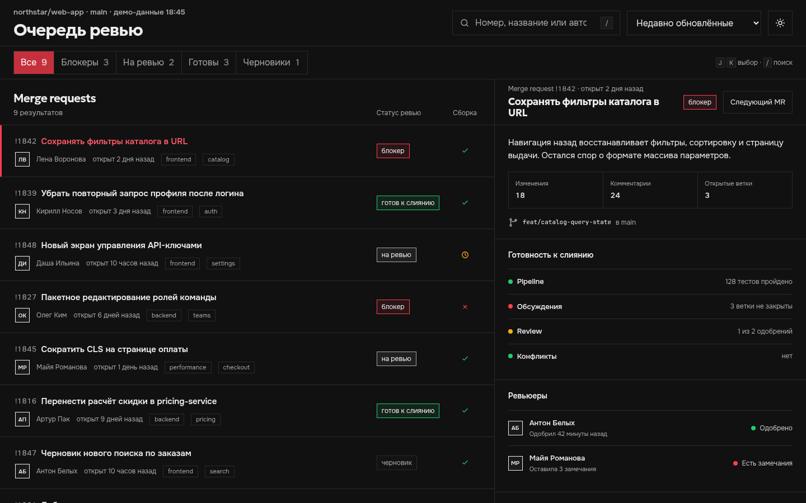
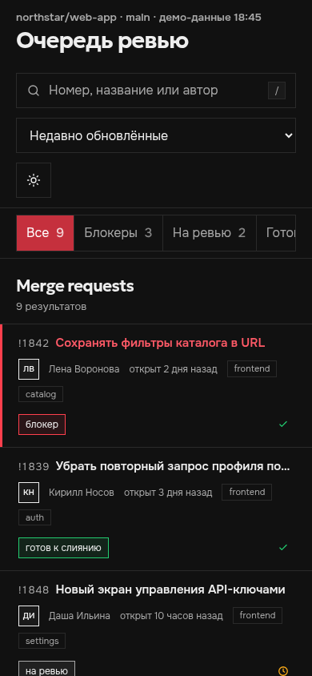
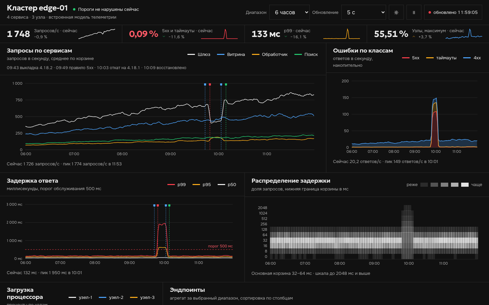
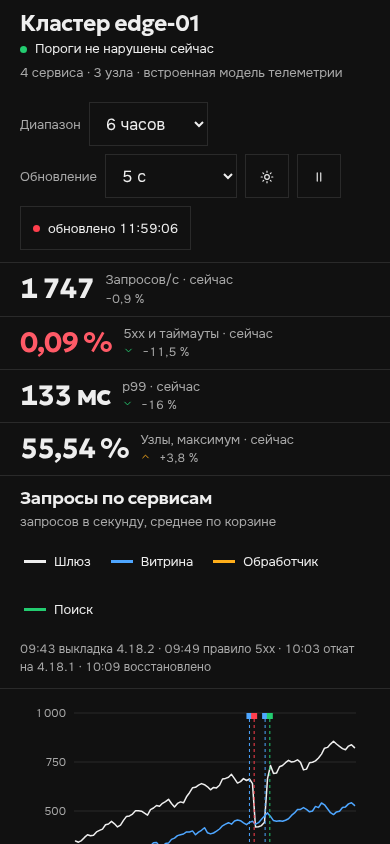

# Craft

Craft — дизайн-система для интерфейсов, презентаций и других форматов. Материалы открываются через `file://`, не требуют сборки и не обращаются к сети.

## Как использовать

### Через агента

Склонируйте репозиторий, перейдите в его папку и установите Craft как глобальный навык:

```bash
npx skills add . --global
```

После перезапуска агента опишите материал и назовите Craft:

```text
Собери в Craft автономный HTML-отчёт по этим данным: …
Сделай в Craft презентацию доклада на 20 минут: …
```

Агент выберет формат, создаст проект и проверит его. Готовый `index.html` открывается напрямую в браузере.

### Из терминала

В корне клонированного репозитория выполните:

```bash
python3 scripts/scaffold.py ./output/отчёт --surface interface --template report --title "Название"
```

Откройте `output/отчёт/index.html` через `file://`. Папка `output/` не входит в репозиторий и служит песочницей для черновых материалов. Для презентации замените параметры на `--surface slides --title "Название доклада"`.

## Кейсы

### Очередь ревью

Локальный инструмент со списком запросов на слияние, деталями выбранной задачи, фильтрами, горячими клавишами и мобильным режимом.

| Широкий экран | Мобильный экран |
|---|---|
|  |  |

### Состояние кластера

Дашборд телеметрии с временными рядами, порогами, журналом событий и адаптивными графиками.

| Широкий экран | Мобильный экран |
|---|---|
|  |  |

Тестовые снимки стартовых материалов хранятся в `tests/visual/baseline/`. `make render` создаёт свежие изображения, а `make visual-test` сравнивает их с эталонами.

## Создание материала

```bash
# Текстовый отчёт
python3 scripts/scaffold.py ./output/отчёт --surface interface --template report --title "Название"

# Дашборд
python3 scripts/scaffold.py ./output/дашборд --surface interface --template dashboard --title "Название"

# Локальный рабочий инструмент
python3 scripts/scaffold.py ./output/инструмент --surface interface --template tool --title "Название"

# Каталог интерфейсной дизайн-системы
python3 scripts/scaffold.py ./output --surface interface --template design-system

# Презентация
python3 scripts/scaffold.py ./output --surface slides --title "Название доклада"
```

Без параметров генератор использует `interface` и `report`. Каркасы `report`, `dashboard` и `tool` задают разную геометрию и поведение первого экрана. Дата по умолчанию — текущая; для воспроизводимого результата передай `--date ГГГГ-ММ-ДД`.

## Устройство репозитория

```text
assets/
├── shared/       общие токены и локальные шрифты
├── interfaces/   тема, стартовый шаблон и каталог интерфейсов
└── slides/       тема 16:9, механика, стартовый шаблон и каталог слайдов
references/       общая грамматика и правила отдельных форматов
scripts/          генерация, проверки, рендеринг и выпуск релизов
craft.json        машиночитаемый реестр форматов
```

Общие решения хранятся в `assets/shared/tokens.css`. Каждый формат сопоставляет эти токены со своими смысловыми ролями, размерами и поведением.

## Язык

Документация, примеры, комментарии, сообщения инструментов и интерфейс CI написаны по-русски. Имена файлов, CSS-классы, JSON-ключи, команды и значения CLI остаются английскими. `make check` проверяет это правило.

## Команды разработки

```bash
make check          # быстрые статические проверки
make test           # генерация, Chromium, переполнение и PDF
make verify         # check + test
make render         # галерея для визуальной проверки
make visual-update  # принять проверенные снимки как эталонные
make visual-test    # сравнить рендеры с эталонами
make dist           # воспроизводимые ZIP-архивы и контрольные суммы
make all            # проверить, отрендерить и упаковать
```

Для разработки нужны Python 3, Node.js и Chromium. Визуальное сравнение требует ImageMagick. Если установлен `pdfinfo`, тест проверит количество страниц PDF. Готовые материалы от этих инструментов не зависят.

## Проверяемые контракты

Быстрая проверка отклоняет изменения, если обнаружены:

- отсутствующие или внешние ресурсы времени выполнения;
- необработанные подстановки за пределами стартовых шаблонов;
- цвета CSS вне общего источника токенов;
- неопределённые CSS-свойства вне документированного API компонентов;
- угловые и трёхсторонние рамки;
- отсутствие правил фокуса, уменьшения движения или печати;
- текст слайдов мельче безопасного для проектора минимума;
- сломанные ссылки в Markdown или синтаксис JavaScript.

Браузерные тесты создают все зарегистрированные сочетания форматов и шаблонов, проверяют переполнение на компактном и широком экранах, навигацию презентации и экспорт всей колоды в PDF.

## Визуальная проверка

`make render` записывает снимки, PDF презентации и автономную галерею в `artifacts/render/`. Это временные артефакты локальной разработки и CI.

Чтобы создать или намеренно изменить визуальные эталоны:

```bash
make visual-update
# Перед commit проверьте tests/visual/baseline/*.png.
make visual-test
```

Порог сравнения учитывает небольшой шум растеризации. Эталоны принимаются только вручную. Браузеры и операционные системы по-разному растеризуют шрифты, поэтому локальная проверка строгая, а ручной запуск в CI сохраняет различия, но не блокирует процесс.

## Релизы

`make dist` создаёт воспроизводимые архивы:

```text
dist/
├── craft-interface.zip
├── craft-slides.zip
├── craft-complete.zip
├── manifest.json
└── SHA256SUMS
```

Временные метки и права доступа внутри архивов нормализованы, поэтому неизменные исходники дают одинаковые контрольные суммы.

Маршрутизация запросов описана в `references/surfaces.md`, добавление нового формата — в `references/extending.md`.
