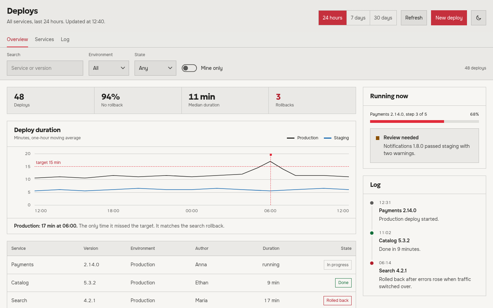

# Craft

[](https://github.com/pavelkorolevxyz/craft/actions/workflows/ci.yml)
[](https://github.com/pavelkorolevxyz/craft/releases/latest)
[](LICENSE)

<a href="https://pavelkorolevxyz.github.io/craft/catalog/interfaces/showcase.html">
  <picture>
    <source media="(prefers-color-scheme: dark)" srcset="tests/visual/baseline/interface-showcase-dark.png">
    
  </picture>
</a>

Craft is an agent skill and a design system for standalone HTML. It covers two formats: pages (reports, dashboards, documents, small tools) and 16:9 slide decks. A project is a folder with `index.html`, CSS, scripts and fonts. It opens over `file://` with no server, no build step and no network.

The repo holds the tokens, CSS, markup fragments, starters, the rules the agent reads and the scripts that create, check and release a project.

Catalogs are published at <https://pavelkorolevxyz.github.io/craft/>:

- [interface catalog](https://pavelkorolevxyz.github.io/craft/catalog/interfaces/index.html), every component and its states;
- [slide catalog](https://pavelkorolevxyz.github.io/craft/catalog/slides/index.html), every layout;
- [mini deck](https://pavelkorolevxyz.github.io/craft/catalog/slides/case-study.html), the slide layouts in one short talk.

## Install

As a skill for a coding agent:

```bash
npx skills add pavelkorolevxyz/craft --global
```

Or clone the repo and link it into the agent's skills folder:

```bash
git clone https://github.com/pavelkorolevxyz/craft.git
ln -s "$PWD/craft" ~/.claude/skills/craft
```

The agent starts at `SKILL.md`, picks the format and template, builds from fragments and runs the checks. The scripts below work without an agent.

## Requirements

| Tool | Used by |
|---|---|
| Python 3 (CI uses 3.12) | every script |
| Chromium | render checks, PDF, screenshots. Set `CHROMIUM=/path` if it is not on `PATH` |
| Node.js 22+ | render checks, through the built-in WebSocket |
| `qrencode`, `zbarimg` | `qr.py` and the QR check in decks |
| ImageMagick | visual tests and the Pages build |

`check_project.py --static-only` needs only Python.

## Create a project

```bash
python3 scripts/scaffold.py ./output/report --surface interface --title "Report"
python3 scripts/scaffold.py ./output/block --surface interface --template bare --title "Block"
python3 scripts/scaffold.py ./output/talk --surface slides --title "Talk" --author "Pavel Korolev"
```

| Option | Values |
|---|---|
| `--surface` | `interface` (default) or `slides` |
| `--template` | interface: `blank` (default) has a header, a theme toggle and the [shell](references/interfaces/shell.md) rules. `bare` is styles only, for a block inside another site. Slides have one template, `deck` |
| `--author` | slides only. The deck opens with the cover slide instead of the title card |
| `--lang` | document language, `en` by default. For `ru` see [material in Russian](references/russian.md) |
| `--delivery` | `local` (default) copies fonts into the project. `web` loads them from Google Fonts |

The target folder must be new or empty.

## Add fragments

`compose.py` inserts a registered fragment into `index.html`. It escapes `--set` values, checks placeholder types and `id` collisions, and copies the scripts the fragment needs. `--html` and `--html-file` pass trusted markup unescaped.

```bash
python3 scripts/compose.py ./output/report --list-fragments
python3 scripts/compose.py ./output/report --fragment section --list-placeholders
python3 scripts/compose.py ./output/report --fragment section \
  --set SECTION_ID=summary --set SECTION_TITLE="Summary" \
  --html 'SECTION_CONTENT=<p>Content</p>'
```

`--dry-run` validates and prints the fragment without writing it. In a deck, `--key` sets the slide key used in `#key` links and edit reports.

## Check

```bash
python3 scripts/check_project.py ./output/report --static-only   # sources only, no browser
python3 scripts/check_project.py ./output/report                 # render pass, for every edit
python3 scripts/check_project.py ./output/report --full          # before handoff
```

The static pass looks for external and missing resources and unfilled placeholders.

The render pass opens the page in Chromium at 1440, 390 and 320 px in both themes. It fails on:

- horizontal scroll;
- text overlapping other text or overflowing its box;
- contrast below WCAG AA;
- fonts under 12 px and tap targets under 24 px;
- a double line where two borders meet;
- controls without an accessible name and skipped heading levels;
- a broken theme toggle.

A deck is checked in every reveal step of every slide: text stays inside, reveals shift nothing, video plays, QR codes scan.

`--full` adds the PDF. For a deck it also checks motion, the control panel, the light theme and deep links. `--shots <dir>` saves a screenshot of each deck state.

The checks render each page in its initial state. Hidden steps, dialogs, filters and empty results need a manual pass.

## Ship

```bash
python3 scripts/bundle.py ./output/report                            # index.single.html with everything inlined
python3 scripts/release.py ./output/talk --out dist --limit-mb 32 --pdf
python3 scripts/release.py ./output/talk --published https://example.com/talk/
```

`bundle.py` works for a page without media. `release.py` packs only the files the material links to and adds `?v=<hash>` to asset links. It writes `manifest.json` with hashes and the commit, refuses draft slides and unfilled placeholders, then unpacks the archive and checks it over `file://`. `--published` compares a deployed copy with the manifest.

Deck helpers:

```bash
python3 scripts/deck_map.py ./output/talk 19 20       # page number to slide key, step and title
python3 scripts/qr.py https://example.com/ --link     # inline SVG QR block with a visible link
```

## Layout

```text
assets/shared/          color and type tokens, fonts
assets/interfaces/      page CSS and scripts, blank and bare starters, fragments
assets/slides/          deck CSS and mechanics, starter, fragments
references/             rules for the agent, one file per topic
catalog/                interface and slide catalogs, published to Pages
site/                   Pages home page
scripts/                create, compose, check, bundle, release, build
scripts/craft.json      registry of formats, fragments, layouts and reading routes
tests/                  behavior tests
tests/visual/           baseline screenshots and the comparison script
tests/agent/            evaluation runs with separate agents
```

Colors live only in `assets/shared/tokens.css`. Both formats map these tokens to their own roles, sizes and mechanics.

## Skill structure

`SKILL.md` only routes. The rules live in `references/`, one file per topic, and the agent opens a file only when the material needs it. Each rule lives in one file, and other files link to it.

`scripts/craft.json` lists the common tasks as reading routes. `make check` fails when:

- a route's links do not reach every file in it;
- a route reads more than 32,000 characters;
- a file is longer than 6,500 characters;
- a reference sits outside every route.

When a route goes over the limit, split a reference or route more precisely. Do not raise the limit.

All prose, comments and messages are in English, and `make check` checks this too.

## Development

```bash
make check          # sources and contracts, no browser, ~6 s
make smoke          # catalogs rendered in Chromium, ~7 s
make test           # behavior tests in parallel, ~30 s
make verify         # check + smoke + test
make visual-test    # render once and compare with tests/visual/baseline
make visual-update  # accept new screenshots after review
make dist           # build and check the archives
```

The [evaluation guide](tests/agent/README.md) describes how separate agents test the skill. It costs money and is not part of the regular tests.

## Releases

Changes per version are in [CHANGELOG.md](CHANGELOG.md). Pushing a `v*` tag makes CI run the checks and publish the archives as a GitHub release. A push to `main` rebuilds the Pages site.

`make dist` writes three archives, `manifest.json` and `SHA256SUMS` to `dist/`:

- `craft-complete.zip`, both formats and the scripts;
- `craft-interface.zip`, pages only, no scripts;
- `craft-slides.zip`, slides only, no scripts.

Verify the archives before unpacking:

```bash
cd dist
sha256sum -c SHA256SUMS
```

## License

Craft is under the [MIT license](LICENSE). The bundled Geologica and Onest fonts are under the [SIL Open Font License 1.1](assets/shared/fonts/OFL.txt). `assets/slides/vendor/highlight.min.js` is highlight.js under BSD-3-Clause, with the notice in the file header.
